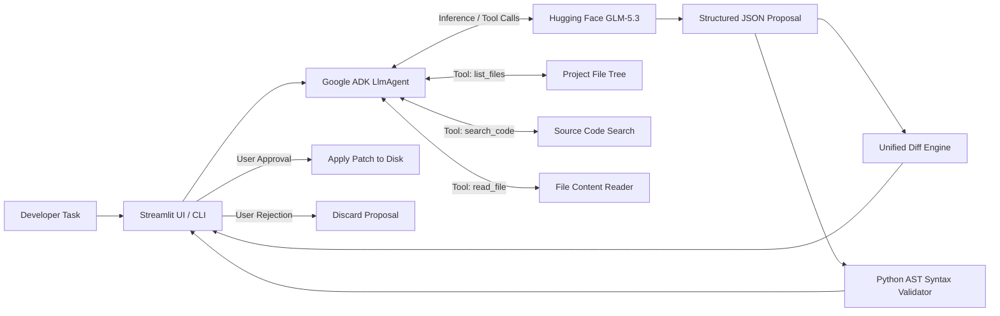

# Patchwork Coding Agent

A review-first AI Coding Agent powered by `zai-org/GLM-5.3` via Hugging Face Inference Providers and orchestrated using the Google Agent Development Kit (ADK).

The agent accepts natural language developer tasks (such as *"Add input validation to this API and write a test for it"*), autonomously inspects the codebase using tool calling, drafts a structured plan, produces unified diff patches, validates Python syntax, and lets the developer safely review and apply or reject the proposal.

---

## Submission Checklist

| Requirement | Details |
| :--- | :--- |
| **GitHub Repository** | [https://github.com/YashGhavghave/Coding-Agent](https://github.com/YashGhavghave/Coding-Agent) |
| **Live Application Link** | *Add public deployment URL here (e.g., Hugging Face Space)* |
| **Primary Model** | **GLM-5.3** (`zai-org/GLM-5.3`) via Hugging Face Inference Providers (`router.huggingface.co/v1`) |
| **Agent Framework** | Google Agent Development Kit (ADK) + LiteLLM |
| **Interfaces** | Streamlit Web UI (`app.py`) & Terminal CLI (`src/agent_harness_build/cli.py`) |
| **Safety & Validation** | Path sandboxing, Python AST syntax compiler check, and human-in-the-loop patch approval |

---

## Architecture and Approach

Patchwork follows a multi-stage review-first workflow designed to prevent unintended code modifications:



### Workflow Stages:
1. **Task Understanding**: The user enters a coding task in natural language.
2. **Repository Discovery**: The agent invokes `list_project_files` to map the source tree (capped at 250 files).
3. **Symbol Search**: The agent calls `search_project_code` to locate relevant functions, classes, and keywords across files.
4. **Targeted File Reading**: The agent uses `read_project_file` to read the exact files needed (capped at 40 KB per file), keeping context tight and preventing token waste.
5. **Structured Proposal Generation**: The model synthesizes the changes and returns a structured JSON payload containing:
   - `plan`: Step-by-step implementation breakdown.
   - `changes`: Full replacement contents for each modified file.
   - `explanation`: Detailed explanation of why the changes were made.
   - `validation`: Suggested shell/test commands to verify the solution.
6. **Resilient JSON Extraction**: A multi-strategy parsing engine with `json-repair` and Markdown fallback handles edge cases, ensuring robust parsing even if the model includes conversational text.
7. **AST Syntax Validation**: Proposed Python files are parsed through Python's AST compiler (`compile(..., 'exec')`). If syntax errors are found, the patch is blocked from being applied.
8. **Unified Diff & Preview**: The developer reviews standard unified diffs and proposed file contents before taking action.
9. **Execution or Rejection**: The developer explicitly clicks **Apply** to write changes to disk or **Reject** to discard them.
10. **Path Sandboxing**: All file paths are strictly sandboxed within the project directory (`_safe_path`), preventing path traversal attacks (`../`).

---

## Repository and Folder Structure

```
Agent Harness Build/
├── .gitignore                   # Ignore rules for virtual envs, caches, and secrets
├── app.py                       # Interactive Streamlit Web UI presentation layer
├── Dockerfile                   # Production Docker image configuration for Hugging Face Spaces
├── pyproject.toml               # Python packaging configuration and dependency definitions
├── README.md                    # Technical documentation and submission guide
├── uv.lock                      # Deterministic lockfile for reproducible builds
│
├── demo_project/                # Sample target codebase for live & offline evaluation
│   ├── user_service.py          # API user creation service requiring input validation
│   └── test_user_service.py     # Unit test suite verifying normalization and error handling
│
├── src/agent_harness_build/     # Core Agent Engine Package
│   ├── agent.py                 # ADK agent setup, tool calling, AST validator, unified diffs
│   ├── cli.py                   # Terminal CLI interface supporting interactive & offline modes
│   ├── __init__.py              # Package initializer routing main execution entry points
│   └── __main__.py              # Direct module runner (python -m agent_harness_build)
│
└── tests/
    └── test_agent.py            # Comprehensive test suite (17 automated pytest test cases)
```

### Component Details:
- **`app.py`**: Streamlit-based web frontend providing real-time task input, codebase file exploration, structured plan rendering, visual unified diffs, AST syntax checks, and one-click patch application.
- **`src/agent_harness_build/agent.py`**: Core agent logic orchestrating the Google ADK `LlmAgent` with `zai-org/GLM-5.3` via LiteLLM. Implements autonomous tools (`list_project_files`, `search_project_code`, `read_project_file`), path traversal protection (`_safe_path`), multi-strategy JSON extraction, and Python AST syntax gate.
- **`src/agent_harness_build/cli.py`**: Full-featured command-line interface allowing developers to run coding tasks, preview unified diffs, and apply patches directly from the terminal or in CI/CD pipelines.
- **`demo_project/`**: An isolated target workspace that isolates sample API logic from agent tooling, providing a concrete evaluation case (*"Add input validation to this API and write a test for it"*).
- **`tests/test_agent.py`**: Automated test suite containing 17 unit tests covering path sandboxing, tool behaviors, proposal parsing resilience, AST syntax verification, and CLI workflows.

---

## Why GLM-5.3 is Useful for this Project

`zai-org/GLM-5.3` was chosen as the dedicated LLM for this coding agent due to several technical advantages:

1. **Code Intelligence & Refactoring Precision**:
   GLM-5.3 has strong comprehension of programming languages, design patterns, and cross-file dependencies. It writes idiomatic code conforming to existing repository styles.
2. **Faithful Multi-Turn Tool-Calling**:
   Agentic workflows require sequential tool executions (`list` -> `search` -> `read`). GLM-5.3 adheres strictly to tool-call schemas and accurately incorporates tool output into its planning.
3. **High-Fidelity Structured JSON Outputs**:
   Generating diffs requires exact schema conformance. GLM-5.3 produces predictable, well-formed JSON objects.
4. **Hugging Face Inference Providers Ecosystem**:
   Through `https://router.huggingface.co/v1`, GLM-5.3 is accessed via standard OpenAI-compatible endpoints with high availability and low latency, making it ideal for containerized deployments with a user token (`HF_TOKEN`).
5. **Context Efficiency**:
   GLM-5.3 efficiently manages token windows during repository exploration, preventing context bloat.

---

## Features

- **Dual Interfaces**: Full interactive Web UI (Streamlit) and Headless Terminal CLI.
- **Autonomous Tool-Calling**: Tools for listing files, regex searching code, and reading file contents.
- **Side-by-Side Unified Diffs**: Clear visual diffs highlighting additions and removals.
- **AST Syntax Error Gate**: Automatically detects syntax errors and blocks applying broken code.
- **Offline Demo Mode**: Test and evaluate the full UI and patch generation workflow without requiring an API key.
- **Security Sandboxing**: Path traversal defense, file read limits (40 KB), and system folder exclusion (`.git`, `.venv`, `__pycache__`).

---

## Demo Project

The repository includes a sample service in `demo_project/` designed around the assignment problem statement (*"Add input validation to this API and write a test for it"*):

- `demo_project/user_service.py`: Contains a `create_user` function lacking validation and normalization.
- `demo_project/test_user_service.py`: Basic test suite ready to be expanded by the agent.

You can test this immediately in the Web UI using the **"Load offline example"** button or via task presets.

---

## Quick Start

### 1. Requirements
- Python 3.12 or newer
- [uv](https://docs.astral.sh/uv/) (recommended)

### 2. Installation
```sh
# Clone repository
git clone https://github.com/YashGhavghave/Coding-Agent.git
cd Coding-Agent

# Install dependencies
uv sync --all-groups
```

### 3. Running the Web UI
```powershell
# Set Hugging Face Token (optional if using Offline Demo Mode)
$env:HF_TOKEN = "hf_your_token"

# Launch Streamlit app
uv run streamlit run app.py
```

### 4. Running via CLI
```sh
# Run offline demo in terminal
uv run python -m agent_harness_build --project demo_project --offline

# Run live task with GLM-5.3
uv run python -m agent_harness_build --project demo_project --task "Add input validation to this API and write a test for it."
```

---

## Testing & Verification

The test suite covers security sandboxing, tool execution, diff generation, AST syntax validation, JSON repair, and CLI workflows:

```sh
# Run the complete test suite (17 passing tests)
uv run pytest

# Run sample project unit tests
uv run python -m unittest discover -s demo_project -v
```

---

## Deploy to Hugging Face Spaces

The project includes a production `Dockerfile` configured for Hugging Face Spaces (`sdk: docker`, port `7860`).

1. Create a new Space on [Hugging Face](https://huggingface.co/spaces) and select the **Docker SDK**.
2. Push this repository to your Space Git remote.
3. In **Settings > Variables and secrets**, add `HF_TOKEN` with Inference Providers access.
4. Launch the Space to access the live web application.

---

## Assumptions and Limitations

- **Scope**: Designed for single-project repositories and microservices with standard text source files (`.py`, `.js`, `.ts`, `.html`, `.json`, `.toml`, etc.).
- **Read Caps**: Individual file reads are limited to 40 KB and repository discovery to 250 files to maintain token efficiency.
- **Safety**: The agent generates unified diffs and performs AST syntax checks; it does not execute arbitrary shell commands without user review.
